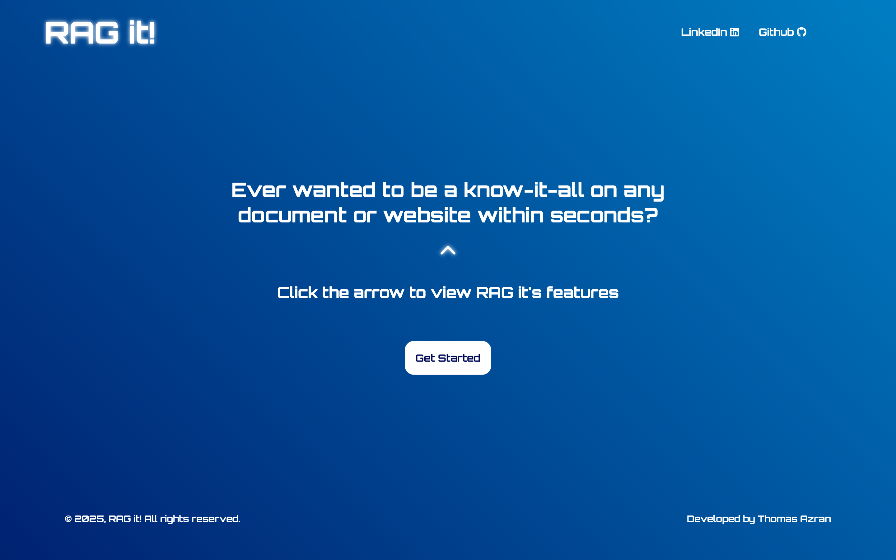
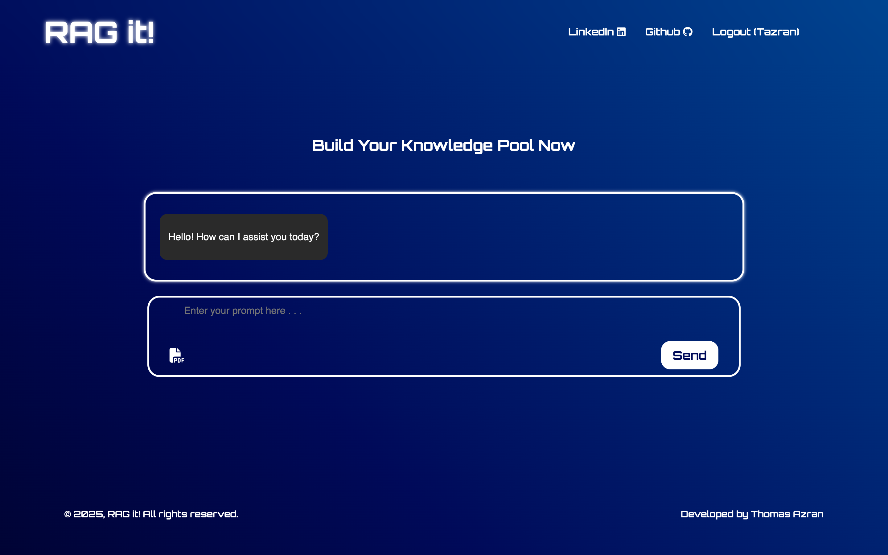
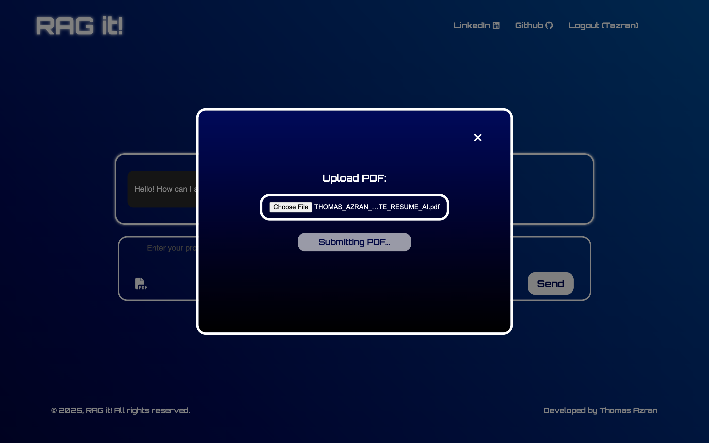
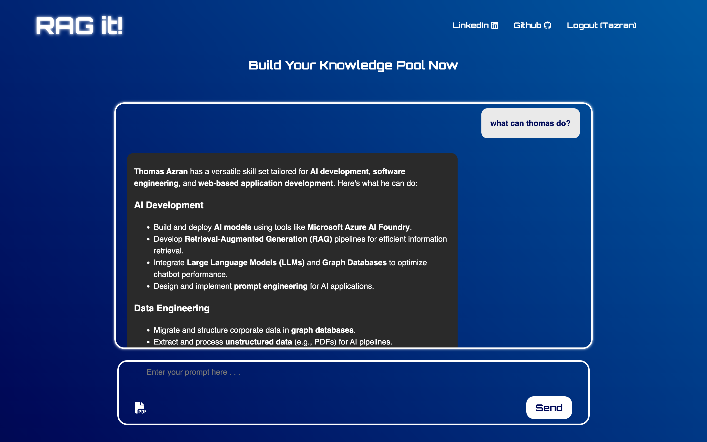

# RAG-it

A Retrieval-Augmented Generation application that lets users upload PDFs content to create personal AI knowledge bases with intelligent chat capabilities. All user data is securely stored on Supabase.

## What It Does

RAG-it processes your documents, converts them into searchable vector databases, and allows you to have conversations with an AI that can reference your specific content. Each user gets their own isolated knowledge base with persistent chat history. Data privacy and security are enforced at every step using Supabase.

## Visit RAG it
[Here](https://ragit.netlify.app/)

## Tech Stack

### Frontend
- **React 18** - Modern React with hooks
- **CSS3** - Custom styling for responsive design
- **Vite** - Fast build tool and development server

### Backend
- Flask web framework
- PostgreSQL database hosted on Supabase
- JWT authentication
- LangChain for RAG orchestration
- Azure OpenAI GPT-4o for responses
- Azure OpenAI text-embedding-3-small for embeddings
- ChromaDB for vector storage
<!-- - PyMuPDF for PDF processing
- Werkzeug for security utilities -->
<!-- - BeautifulSoup4 for web scraping -->

## How It Works

1. User registers/logs in through JWT authentication
2. Upload PDFs for content ingestion
3. Documents are processed, chunked, and converted to embeddings
4. Embeddings stored in user-specific, secured ChromaDB vectorstore
5. Metadata and chat history stored on Supabase
6. Chat queries trigger similarity search to find relevant content
7. AI generates responses using retrieved context and chat history

## Demonstration

### Homepage 

### Chat

### PDF Digestion

### RAG in action

## Key Features

- User data stored securely on Supabase
- User-specific vector databases for privacy and security
- Persistent chat history across sessions
- PDF upload content ingestion
- Context-aware conversations
- Mobile-responsive interface
- Secure authentication with password hashing and token-based access
- All user data encrypted and isolated for complete security

## Architecture

The application uses a standard RAG pipeline: document ingestion → text chunking → embedding generation → vector storage → retrieval → AI response generation. Each user maintains separate, secured vectorstores and chat histories, with persistent metadata stored on Supabase to ensure complete data isolation and protection.
